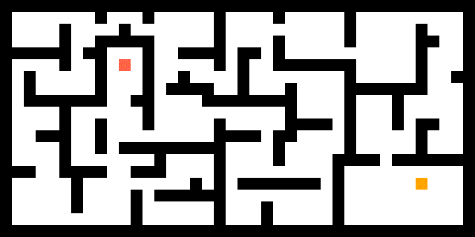
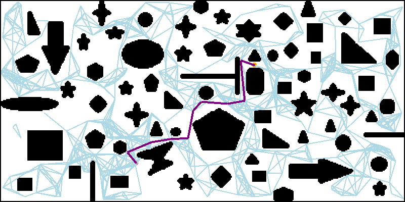
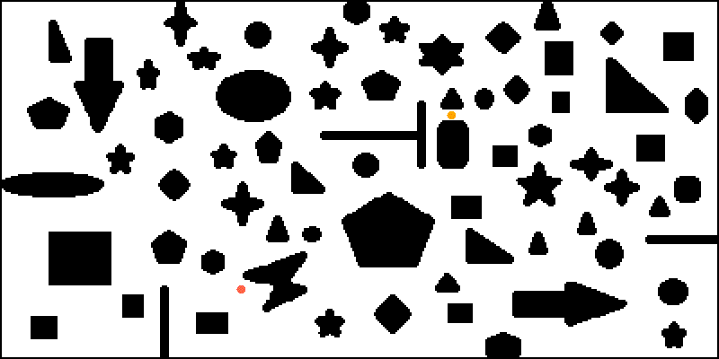
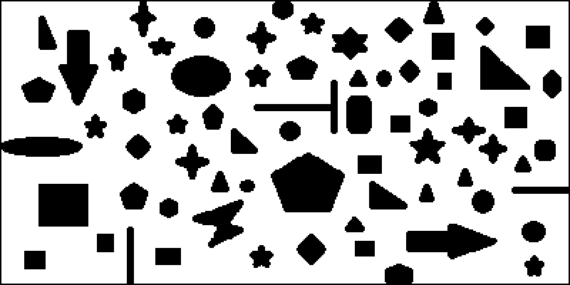

说明文档见：[https://gitee.com/ghowoght/motion-planning](https://gitee.com/ghowoght/motion-planning)

## 程序说明

程序入口在`MotionPlanner.cs`，目前不支持可视化地选择规划算法，所以要在代码里进行选择。首先选择地图类型，图搜索算法使用的地图和随机采样算法用的地图是不一样的，当然可以混用，只是显示效果略有不同，相关的代码如下。如果选择图搜索算法，就将随机采样部分注释掉，反之同理。

```c#
// 图搜索地图
GridMap gridMap = new GridMap("../../map/graph/xxx.txt");
GraphPainter painter = new GraphPainter(pcb_display, gridMap);

// 随机采样地图
GridMap gridMap = new GridMap("../../map/sampling/xxx.txt");
SamplingPainter painter = new SamplingPainter(pcb_display, gridMap);
```

接下来选择要运行的规划算法，以A\*算法为例，程序如下，其他算法在程序中都有使用示例。

```C#
Astar astar = new Astar(gridMap);
new Thread(astar.Search)
{
    IsBackground = true
}.Start();
```

## 关于地图

- 图搜索算法的地图可以直接在程序运行界面进行编辑，使用鼠标左键单击色块就可以改变当前位置的状态。

- 随机采样算法的地图编辑方法见[这里](MotionPlanner/map/sampling/README.md)。

## 效果演示

### Search-Based

图搜索算法地图大小为20\*40。

|      |            |
| :-----------------------------------------: | :-----------------------------------------------: |
|                     DFS                     |                        BFS                        |
|    |  |
|                    GBFS                     |                     Dijkstra                      |
|  |            |
|                     A\*                     |                        JPS                        |

### Sampling-Based

采样算法地图大小为200\*400。

|                   |                |
| :----------------------------------------------------------: | :-------------------------------------------------------: |
|                             PRM                              |                            RRT                            |
|   |        |
|                         RRT-Connect                          |                           RRT\*                           |
|  |  |
|                        Informed-RRT\*                        |                 Multi-Goals Path-Planning                 |

